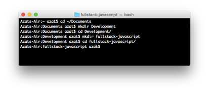
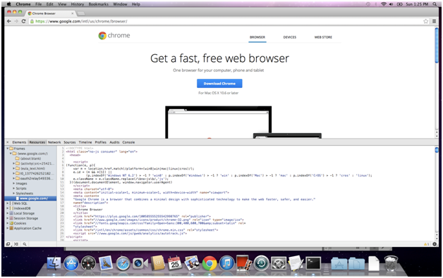
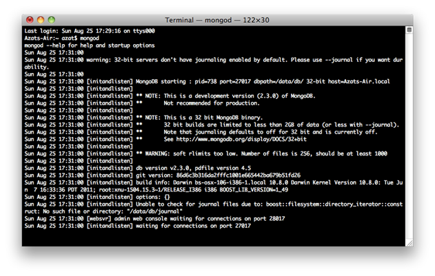
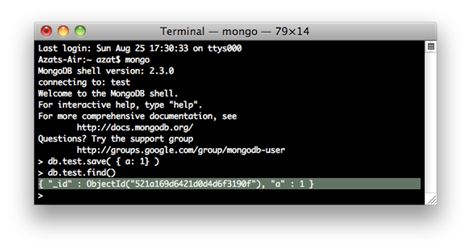
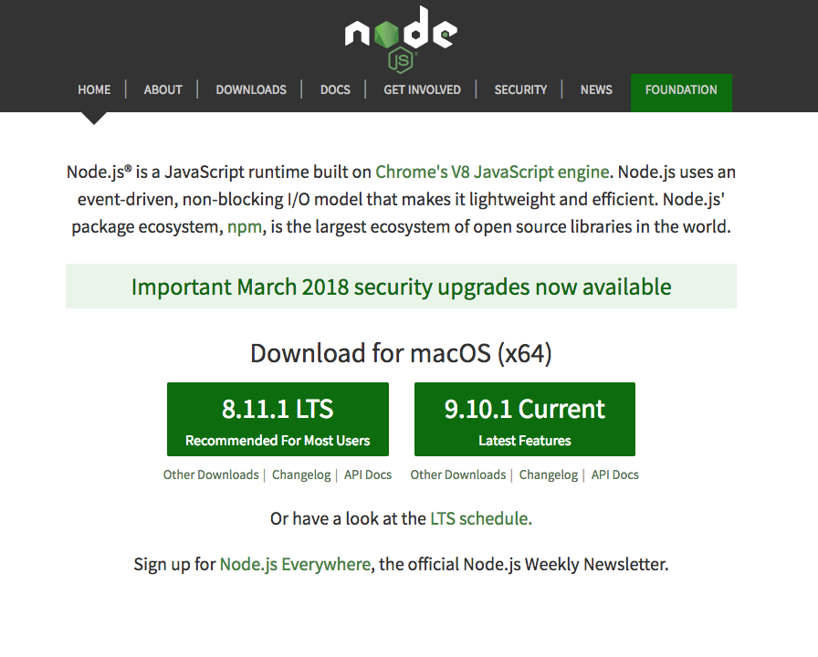
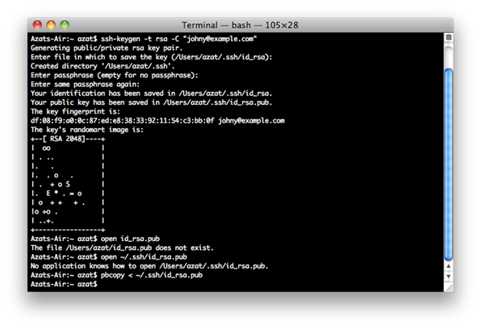
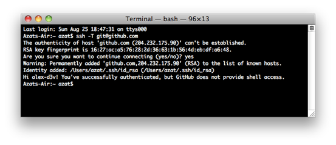
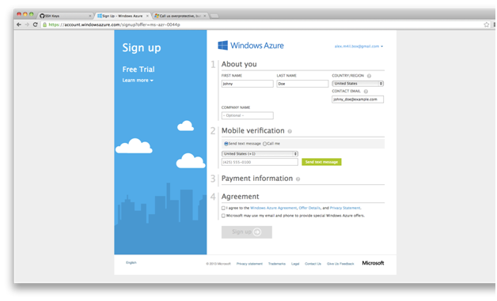
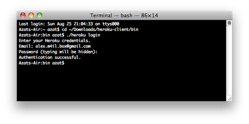

CHAPTER 2
---------

Setup
=====

> *One of my most productive days was throwing away 1,000 lines of code.*
>
> —[Ken Thompson](http://en.wikipedia.org/wiki/Ken_Thompson)

In this chapter, we'll cover the following topics:

-   Suggestions for the toolset

-   Step-by-step installation of local components

-   Preparation for the use of cloud services

The proper setup is absolutely crucial to your productive development. You need to have everything ready when you embark on a long journey, right? The two important things to install are dependencies and the toolset. Dependencies are absolutely necessary and technologies like Node.js or MongoDB. Moreover, the toolset is highly recommended because it will make you more productive. They enable the server-side code and persistence, respectively. In addition to that, in the cloud section, we cover setup of the services for deployment and development. They will enable you to keep your code under version control and deploy it in a scalable manner.

Local Setup
===========

Local setup is what we use on our development machines when we work on a project. It includes anything from folders, browsers, editors, and HTTP servers to databases. Figure 2-1 shows an example of the initial development environment setup.

Development Folder
------------------

If you don't have a specific development folder for your web development projects, you could create a `Development` folder in the `Documents` folder (path will be `Documents/Development`). To work on the code example, create a `fullstack-javascript` folder inside your web development projects folder; for example, if you create a `fullstack-javascript` folder inside of the `Development` folder, the path will be `Documents/Development/fullstack-javascript`. You could use the Finder app on macOS or the following terminal commands on Posix (macOS X/Linux) systems:

`$ cd ~/Documents`
`$ mkdir Development`
`$ cd Development`
`$ mkdir fullstack-javascript`

***Figure 2-1.** Initial development environment setup*

**Tip** To open macOS Finder app in the current directory from Terminal, just type and run the $ open . command. On Windows, Terminal is command prompt.

To get the list of files and folders, use this UNIX/Linux command:

`$ ls`

or to display hidden files and folders, like .git, use this:

`$ ls -lah`

Another alternative to `$ ls` is `$ ls -alt`. The difference between the `-lah` and the `-alt` options is that the latter sorts items chronologically and the former sorts them alphabetically.

You can use the Tab key to autocomplete names of the files and folders.

Later, you could copy examples into the `fullstack-javascript` folder as well as create apps in that folder.

**Tip** Another useful thing is to have the New Terminal at Folder option in Finder on macOS. To enable it, open your System Preferences (you could use Command + Space, a.k.a. Spotlight, for it). Find Keyboard and click it. Open Keyboard Shortcuts and click Services. Select the New Terminal at Folder and New Terminal Tab at Folder check boxes. Close the window (optional).

Browsers
--------

I recommend downloading the latest version of the WebKit or Gecko browser of your choice:

-   [Chrome](https://www.google.com/chrome) (<https://www.google.com/chrome>) (recommended)
-   [Safari](https://www.apple.com/safari) (<https://www.apple.com/safari>)
-   [Firefox](https://www.mozilla.org/en-US/firefox/new) (<https://www.mozilla.org/en-US/firefox/new>)

Whereas Chrome (Figure 2-2) and Safari already come with built-in developer tools, you'll need the Firebug plug-in for Firefox .

***Figure 2-2.** Chrome Developer Tools in action*

Firebug and developer tools allow developers to do many things, including these:

-   Debug JavaScript
-   Manipulate HTML and DOM elements
-   Modify CSS on the fly
-   Monitor HTTP requests and responses
-   Run profiles and inspect heap dumps
-   See loaded assets such as images, CSS, and JS files

There are some great Chrome Developer Tools (DevTools) tutorials, such
as the following:

-   Explore and Master Chrome DevTools (<https://discover-devtools.codeschool.com> ) with Code School
-   Chrome DevTools videos (<https://developers.google.com/chrome-developer-tools/docs/videos>)
-   Chrome DevTools overview (<https://developers.google.com/chrome-developer-tools>)

IDEs and Text Editors
---------------------

One of the best things about JavaScript is that you don't need to compile the code. Because JS lives in and is run in a browser, you can do debugging right there, in a browser! It's an interpreted language, not a compiled one. Therefore, I highly recommend a lightweight text editor instead of a full-blown integrated development environment, or IDE, but if you are already familiar and comfortable with the IDE of your choice like Eclipse (<http://www.eclipse.org>), NetBeans (<http://netbeans.org>), or Aptana (<http://aptana.com>), feel free to stick with it.

Here is a list of the most popular text editors and IDEs used in web
development:

- [*VS Code*](https://www.visualstudio.com/features/node-js-vs) (<https://www.visualstudio.com/features/node-js-vs>): Node.js tools for the famous Visual Studio environment from a small Redmond, Washington-based software startup company.
- [*Atom*](https://atom.io) (<https://atom.io>): A web editor built on web technologies from the creators of GitHub the world's largest code storage and collaboration space.
-   [*Sublime Text*](https://www.sublimetext.com) (<https://www.sublimetext.com>): macOS and Windows versions are available. This is an even better alternative to TextMate, with an unlimited evaluation period.
-   [*Coda*](http://panic.com/coda) (<http://panic.com/coda>): All-in-one editor with FTP browser and preview, has support for development with and on an iPad.
-   [*Aptana Studio*](http://aptana.com) (<http://aptana.com>): Full-sized IDE with a built-in terminal and many other tools.
-   [*WebStorm*](http://www.jetbrains.com/webstorm) (<http://www.jetbrains.com/webstorm>): Feature-rich IDE that allows for Node.js debugging. It is developed by JetBrains and marketed as the smartest JavaScript IDE.

Please, please, please don't use Vim, TextEdit or Notepad++! Having code coloring and parentheses matching will make a great difference when typing and debugging.

Version Control Systems
-----------------------

A version control system is a must-have even in projects with a single developer because such a system keep all the history which makes it easy to restore code or revert changes. Git is the most popular version control system.

Also, many cloud services (e.g., Heroku) require Git for deployment. I also highly recommend getting used to Git and Git terminal commands instead of using Git visual clients and apps with a GUI: GitX (<http://gitx.frim.nl>), Gitbox (<http://www.gitboxapp.com>), or GitHub for Desktop (<https://desktop.github.com>).

Subversion is a nondistributed version control system. This article compares Git vs. Subversion: <https://git.wiki.kernel.org/index.php/GitSvnComparison>).

Here are the steps to install and set up Git on your machine:

1.  Download the latest version for your OS at <https://git-scm.com/downloads>.

2.  Install Git from the downloaded `\*.dmg` package; that is, run the `\*.pkg` file and follow the wizard.

3.  Find the Terminal app by using Command + Space, a.k.a. Spotlight, on macOS. For Windows you could use [PuTTY](http://www.chiark.greenend.org.uk/~sgtatham/putty) (<http://www.chiark.greenend.org.uk/~sgtatham/putty>) or Cygwin (<http://www.cygwin.com>).

4.  In your terminal, type these commands, substituting "John Doe" and johndoe@example.com with your name and e-mail:

	`$ git config --global user.name "John Doe"`
	`$ git config --global user.email johndoe@example.com`

5.  To check the installation, run this command:

	`$ git version`

6.  You should see something like this in your terminal window (your version might vary; in my case it's 1.8.3.2):

	`git version 2.14.3 (Apple Git-98)`

Generating SSH keys and uploading them to SaaS/PaaS web sites will be covered later.

Local HTTP Servers
==================

Although you can do most of the front-end development without a local HTTP server, it is needed for loading files with HTTP Requests/AJAX calls. Also, it's just good practice in general to use a local HTTP server. This way, your development environment is as close to the production environment as possible.

I recommend you use Node-based tools as static web servers. They lack GUIs, but they are simple and fast. You can install them with npm (comes with Node.js; instructions are later in this chapter):

-   [*node-static*](https://github.com/cloudhead/node-static) (<https://github.com/cloudhead/node-static>): Static file server with built-in caching. Run `npm i -g node-static` to install.

-   [*http-server*](https://www.npmjs.com/package/http-server) (<https://www.npmjs.com/package/http-server>): Zero-configuration command-line HTTP server. Run `npm i -g htt-server` to install.

If you prefer something with GUIs to a command-line interface (CLI), you might want to consider the following modifications of the Apache web server. MAMP, MAMP Stack, and XAMPP have intuitive GUIs that allow you to change configurations and host file settings.

-   [*XAMPP*](http://www.apachefriends.org) (<http://www.apachefriends.org>): Apache distribution containing MySQL, PHP and Perl for Windows, macOS, Linux, and Solaris.
-   [*MAMP*](<http://www.mamp.info>) (<http://www.mamp.info>): Apache, MySQL, and PHP personal web server for macOS.
-   [*MAMP Stack*](https://bitnami.com/stack/mamp) (<https://bitnami.com/stack/mamp>): Another Apache, MySQL, and PHP stack for macOS.

Database: MongoDB
-----------------

The following steps are better suited for macOS/Linux-based systems, but with some modification they can be used for Windows systems as well (i.e., `$PATH` variable, Step 3). Here I describe the MongoDB installation from the official package, because I found that this approach is more robust and leads to less conflicts. However, there are many other ways to install it on macOS (<http://docs.mongodb.com/manual/tutorial/install-mongodb-on-os-x>), for example using Brew, as well as on other systems (<http://docs.mongodb.com/manual/installation>).

1.  Download MongoDB from <http://www.mongodb.com/download-center#community>. For the latest Apple laptops, like MacBook, select macOS X 64-bit version. The owners of older Macs should browse the link at <http://dl.mongodb.com/dl/osx/i386>.

	**Tip** To figure out the architecture type of your processor, type the $ uname -p at the command line.

2.  Unpack the package into your web development folder (`~/Documents/Development` or any other). If you want, you could install MongoDB into the `/usr/local/mongodb` folder.
3.  Optional: If you would like to access MongoDB commands from anywhere on your system, you need to add your `mongodb` path to the `$PATH` variable. For macOS, open system `/etc/paths` file with:

	`sudo vi /etc/paths`

	or, if you prefer VS Code:

	`code /etc/paths`

	And add this line to the /etc/paths file:

	`/usr/local/mongodb/bin`

4.  Create a `data` folder; by default, MongoDB uses `/data/db`. Please note that this might be different in new versions of MongoDB. To create it, type and execute the following commands in the terminal:

	`$ sudo mkdir -p /data/db`
	`$ sudo chown id -u /data/db`

	If you prefer to use a path other than `/data/db` you could specify it using the `--dbpath` option to `mongod` (the main MongoDB service).

5.  Go to the folder where you unpacked MongoDB. That location should have a bin folder in it. From there, type the following command in your terminal:

	`$ ./bin/mongod`

6.  If you see something like the following (and as in Figure 2-3) it means that the MongoDB database server is running:

	`MongoDB starting: pid =7218 port=27017...`

	By default, it's listening at <http://localhost:27017>. If you go to your browser and type <http://localhost:28017> you should be able to see	the version number, logs, and other useful information. In this case the MondoDB server is using two different ports (27017 and 28017): One is primary (native) for the communications with apps and the other is a web-based GUI for monitoring and statistics. In our Node.js code we'll be using only 27017. Don't forget to restart the Terminal window after adding a new path to the `$PATH` variable.

	

	***Figure 2-3.** Starting up the MongoDB server*

	Now, to take it even further, we can test to determine if we have access to the MongoDB console/shell, which will act as a client to this server. This means that we'll have to keep the terminal window with the server open and running.

7.  Open another terminal window at the same folder and execute:

	`$ ./bin/mongo`

	You should see something like "MongoDB shell version..."

8.  Then type and execute:

	`> db.test.save( { a: 1 } )`
	`> db.test.find()`

	If you see that your record is being saved, then everything went well
	(Figure 2-4).

***Figure 2-4.** Running MongoDB client and storing sample data*

Commands `find` and `save` do exactly what you might think they do.

The official MongoDB website has the detailed instructions for installing MongoDB on macOS at: <http://docs.mongodb.com/manual/tutorial/install-mongodb-on-os-x>. TK

**Note** MAMP and XAMPP applications come with MySQL—an open source traditional SQL database—and phpMyAdmin—a web interface for MySQL database.

On macOS (and most UNIX systems), to close the process use Control + C. If you use Control + Z it will put the process to sleep (or detach the terminal window); in this case, you might end up with the lock on data files and will have to use the `kill` command or Activity Monitor, and manually delete the locked file in the data folder. In vanilla Mac
Terminal Command + . is an alternative to Control + C.

Required Components
----------------

The following are required technologies. Please make sure you have them before
proceeding to the next chapter.

1.  *Node.js*: We need it for build tools and back-end apps. Get the version that has LTS even if the number is lower than the current NON-LTS version, because the LTS versions have longer support period: <https://nodejs.org>.
2.  *npm*: The Node package manager that comes bundled with Node (no need to install anything extra).
3.  *Browser JS libraries*: We need them for front-end apps.

I highly recommend installing other optional but useful components:

1.  *nvm*: The Node version manager, which allows to switch between Node versions quickly.
2.  *Compass*: A desktop client GUI app for working with MongoDB as a replacement of the Mongo shell/REPL. <https://www.mongodb.com/products/compass>

### Node.js Installation

Node.js is available at <http://nodejs.org/#download> (Figure 2-5). The installation is trivial: Download the archive and run the `*.pkg` package installer. To check the installation of Node.js, you could type and execute:

`$ node -v`

I use v8.11.1 for this book and tested all examples with v8.11.1. If you use another version, do so at your own risk. I cannot guarantee that the examples will run.

Assuming you have 8.11.1, it should show something similar to this: `v8.11.1`.

If you want to switch between multiple versions of Node.js, there are solutions for that:

-   [*nvm*](https://github.com/creationix/nvm) (<https://github.com/creationix/nvm>): Node.js Version Manager
-   [*Nave*](https://github.com/isaacs/nave) (<https://github.com/isaacs/nave>): Virtual environments for Node.js
-   [*n*](https://github.com/tj/n) (<https://github.com/tj/n>): Node.js version management

The Node.js package already includes npm—[Node Package Manager](https://npmjs.org) (<https://npmjs.org>). We'll use npm extensively to install Node.js modules.

***Figure 2-5**. Node.js home page that shows LTS and non-LTS versions*

### Browser JavaScript Libraries

Front-end JavaScript libraries are downloaded and unpacked from their respective web sites. Those files are usually put in the Development folder (e.g., `∼/Documents/Development`) for future use. Often, there is a choice between the minified production version (more on that in the AMD and Require.js section of Chapter 4) and a version that is extensively rich development comments.

Another approach is to hot-link these scripts from CDNs such as [Google Hosted Libraries](https://developers.google.com/speed/libraries/devguide) (<https://developers.google.com/speed/libraries/devguide>), CDNJS (<http://cdnjs.com>), Microsoft Ajax Content Delivery Network (<https://docs.microsoft.com/en-us/aspnet/ajax/cdn/overview>), and others. By doing so the apps will be faster for some users, but won’t work locally at all without the Internet.

Speaking of dependencies, I recommend downloading the following libraries that will be used in the book's project. To keep things simple, we will use just simple `.js` or `.min.js` files and not the npm packages:

-   Bootstrap is a CSS/Less framework. It's available at <https://getbootstrap.com>.
-   jQuery is available at <https://jquery.com>.
-   Backbone.js is available at <https://backbonejs.org>.
-   Underscore.js is available at <https://underscorejs.org>.
-   Require.js is available at <https://requirejs.org>.

### Less App

Less as a front-end interpreter is available at [lesscss.org](http://lesscss.org). You could unpack it into your development folder (`~/Documents/Development`) or any other folder.

The Less App is a macOS application for "on-the-fly" compilation of Less to CSS. It's available at [incident57.com/less](http://incident57.com/less). TK

Cloud Setup
===========

The cloud setup discussed in the following sections will allow you to keep your code under version control and deploy it in a scalable manner.

SSH Keys
--------

For GitHub repositories, developers have to enter username and password every time with HTTPS URLs (looks like <https://github.com/azat-co/fullstack-javascript.git>), unless they use a keychain. SSH keys provide a secure connection without the need to enter a user name
and password every time. The SSH URLs look like `git@github.com:azat-co/fullstack-javascript.git`.

To generate SSH keys for GitHub on macOS/UNIX machines, do the following:

1.  Check for existing SSH keys:

    $ cd ~/.ssh
    $ ls -lah

2.  If you see some files like `id_rsa` (please refer to Figure 2-6 for an example), you could delete them or back them up into a separate folder by using the following commands:

	$ mkdir key_backup
    $ cp id_rsa* key_backup
    $ rm id_rsa*

3.  Now generate a new SSH key pair using the `ssh-keygen` command, assuming we are in the `~/.ssh` folder:

	$ ssh-keygen -t rsa -C "your_email@youremail.com"

4.  Answer the questions; it is better to keep the default name of `id_rsa`. Then copy the content of the `id_rsa.pub` file to your clipboard (Figure 2-6):

    $ pbcopy < ~/.ssh/id_rsa.pub

	

	***Figure 2-6.** Generating RSA key for SSH and copying public key to clipboard*

5.  Alternatively, open `id_rsa.pub` file in the default editor:

	`$ edit id_rsa.pub`

    Or in VS Code (recommended):

	`$ code id_rsa.pub`

GitHub
------

The next steps will show how to connect to GitHub (think of it as a versioned code storage) using SSH and SSH keys:

1.  After you have copied the public key, go to <https://github.com>, log in, go to your account settings, select SSH Key, and add the new SSH key. Assign a name, such as the name of your computer, and paste the value of your public key.

2.  To check if you have an SSH connection to GitHub, type and execute the following command in your terminal:

	`$ ssh -T git@github.com`

	If you see something like this:

	`Hi your-GitHub-username! You've successfully authenticated,`
	`but GitHub does not provide shell access.`

	then everything is set up.

3.  The first time you connect to GitHub, you may receive a message "Authenticity of Host … Can't Be Established warning". Please don't be alarmed with such a message. It confirms that the host you are trying to connect to is trusted. Simply proceed by answering "Yes" as shown in Figure 2-7.

***Figure 2-7.** Testing SSH connection to GitHub for the very first time*

If for some reason you have a different message, please repeat Steps 3 and 4 from the previous section on SSH keys or reupload the content of your `*.pub` file to GitHub.

	Warning Keep your id_rsa file private and don't share it with anybody!

More instructions are available at GitHub: [Generating SSH Keys](https://help.github.com/articles/generating-ssh-keys) (<https://helpgithub.com/articles/generating-ssh-keys>). TK

Windows users might find the SSH key generator feature in PuTTY useful.

Microsoft Azure
-------------

Here are the steps to set up a Microsoft Azure account:

1.  You'll need to sign up for Microsoft Azure Web Site and Virtual
    Machine previews. Currently they have a 90-day free trial available
    at <https://azure.microsoft.com/en-us>.

2.  Enable Git Deployment and create a user name and password, then
    upload the SSH public key to Microsoft Azure.

3.  Install the Node.js SDK, which is available at
    <https://azure.microsoft.com/en-us/develop/nodejs>.

4.  To check your installation type:

	`$ azure -v`

	You should be able to see something like this:

	`Microsoft Azure: Microsoft's Cloud Platform... Tool Version 0.6.0`

5.  Log in to Microsoft Azure Portal at <https://windows.azure.com>
    (Figure 2-14).

	

	***Figure 2-14.** Registering on Microsoft Azure*

6.  Select New, then select Web Site, and Quick Create. Type the name
    that will serve as the URL for your web site, and click OK.

7.  Go to this newly created web site's Dashboard and select Set Up
    Git Publishing. Come up with a user name and password. This
    combination can be used to deploy to any web site in your
    subscription, meaning that you do not need to set credentials for
    every web site you create. Click OK.

8.  On the follow-up screen, it should show you the Git URL to push to,
    something like this:

	`https://azatazure@azat.scm.azurewebsites.net/azat.git`

	You will also see instructions on how to proceed with deployment. We'll
	cover them later.

9.  Advanced user option: Follow this tutorial to create a virtual
    machine and install MongoDB on it: [Install MongoDB on a virtual
    machine running CentOS Linux in Microsoft Azure](https://www.windowsazure.com/en-us/manage/linux/common-tasks/mongodb-on-a-linux-vm) (https://www.windowsazure.com/en-us/manage/linux/common-tasks/mongodb-on-a-linux-vm).

Heroku
------

Heroku is a polyglot agile application deployment platform (see
<http://www.heroku.com>). Heroku works similarly to Microsoft Azure in
the sense that you can use Git to deploy applications. There is no need
to install Virtual Machine for MongoDB because [Heroku has a MongoHQ
add-on](https://addons.heroku.com/mongohq)
(https://addons.heroku.com/mongohq).

To set up Heroku, follow these steps:

1.  Sign up at <http://heroku.com>. Currently they have a free account;
    to use it, select all options as minimum (0) and database as shared.

2.  Download Heroku Toolbelt at (https://toolbelt.heroku.com) Toolbelt
    is a package of tools; that is, libraries that consist of Heroku,
    Git, and Foreman ( <https://github.com/ddollar> foreman). For users
    of older Macs, get this client ( <https://github.com/heroku/heroku> )
    directly. If you utilize another OS, browse Heroku Client
    GitHub (https://github.com/heroku/heroku) .

3.  After the installation is done, you should have access to the
    heroku command. To check it and log in to Heroku, type:

	`$ heroku login`

	It will ask you for Heroku credentials (user name and password), and if
	you've already created the SSH key, it will automatically upload it to
	the Heroku web site (Figure 2-15).

	

	***Figure 2-15.** The response to the successful $ heroku login command*

4.  If everything went well, to create a Heroku application inside of
    your specific project folder, you should be able to run this
    command:

	`$ heroku create`

More [^1]detailed step-by-step instructions are available at Heroku:
Quickstart ( <https://devcenter.heroku.com> articles/quickstart ) and
Heroku: Node.js ( <https://devcenter.heroku.com/articles/nodejs>).

Summary
=======

In this chapter, we've covered the technical setup of the version
control system, cloud clients as well as installed various tools and
libraries. We'll use these libraries and tools in the books, for this
reason it's important to have them installed and ready to go. In
addition, the chapter provided a few links to external resources which
can make you understand and learn web development tools better. One of
the most useful of such resources is DevTools.

You must be dying to get started with the actual coding. The wait is
over. Meet the first fullstack JavaScript code in the next chapter.
